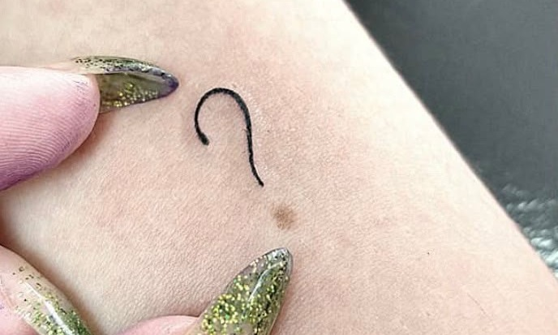
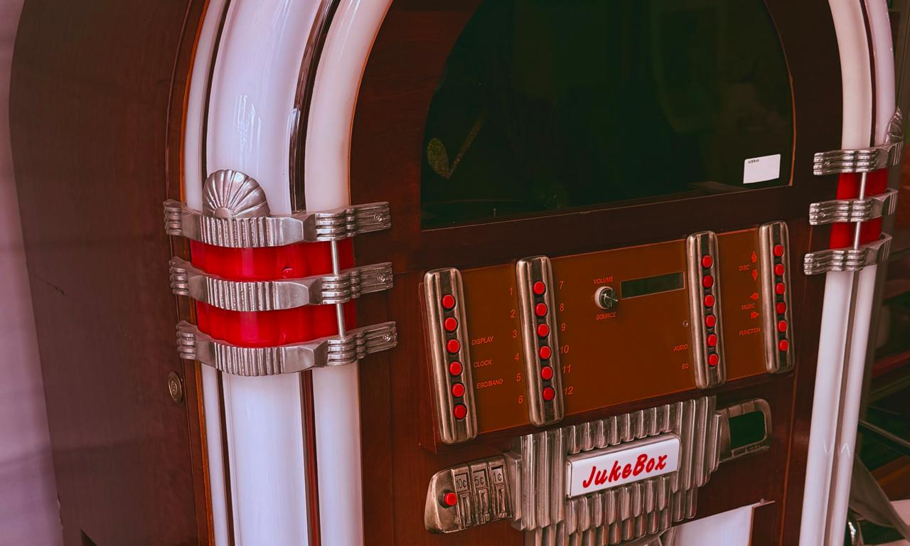

# Olá, eu sou a Natalia Armstrong 🦖

### Desenvolvedora Backend · Node.js · TypeScript · NestJS

Movida pela curiosidade de entender como tudo funciona.

---

## Sobre mim

Sou desenvolvedora backend e trabalho principalmente com **Node.js, TypeScript e NestJS**, criando e evoluindo APIs REST que vivem em produção. Gosto de sistemas organizados, confiáveis e escaláveis, sobretudo quando envolvem arquitetura, segurança, integrações, mensageria e regras de negócio que não cabem em um tutorial. Embora não seja minha stack principal, também já atuei no desenvolvimento frontend web com **React e Next.js** e mobile com **React Native e Expo**. Gosto de me aventurar em projetos pessoais fullstack, especialmente porque é quando posso inventar moda e deixar minha criatividade e imaginação fluirem.

No dia a dia, transito entre modelagem de dados, autenticação, filas, webhooks, serviços externos e testes. Também atuo com práticas de **DevOps**, criando e mantendo pipelines de **CI/CD**, automatizando processos de qualidade e deploy e acompanhando aplicações em produção. Além do desenvolvimento, participo de **reuniões técnicas com clientes** para entender necessidades, alinhar soluções, esclarecer requisitos e transformar desafios de negócio em decisões técnicas viáveis. Também conduzo **treinamentos técnicos para colaboradores**, compartilhando conhecimentos, boas práticas e orientações sobre ferramentas e processos.

Sou muito comunicativa, curiosa e bem-humorada. Adoro trocar ideias sobre tecnologia, sobre a vida e sobre tudo o que existe no meio do caminho. Valorizo documentação que realmente ajuda, colaboração sem complicação e a liberdade de perguntar “como isso funciona por dentro?” até a resposta fazer sentido.

## O que faço no backend

Minha stack principal está no ecossistema Node.js, com TypeScript e NestJS. Ao redor dela, uso ferramentas que ajudam a cuidar de todo o ciclo de uma aplicação: dos dados e contratos à segurança, observabilidade e entrega.

| Área | Ferramentas e tecnologias |
| --- | --- |
| **APIs e contratos** | NestJS, Express, Fastify, APIs REST, Swagger/OpenAPI, class-validator e Zod |
| **Arquitetura e modelagem** | Clean Architecture, arquitetura hexagonal, DDD, SOLID e KISS |
| **Experiência complementar** | Python e Flask |
| **Frontend e mobile** | React, Next.js, React Native e Expo |
| **Dados e persistência** | PostgreSQL, MongoDB, Prisma ORM, migrations e transações |
| **Cache e assíncrono** | Redis, BullMQ, workers, retries e tarefas agendadas |
| **Segurança** | Passport, JWT, OAuth 2.0, OpenID Connect, login com Google e Microsoft, bcrypt, MFA, RBAC, rate limiting e cookies HTTP-only |
| **Integrações** | Webhooks, gateways de pagamento, PIX, APIs externas e storage compatível com S3 |
| **IA e automações** | RAG, bots e integrações multicanal com WhatsApp, Telegram e e-mail |
| **Qualidade** | Jest, Supertest, ESLint, Prettier e testes unitários, arquiteturais e E2E |
| **Infraestrutura** | Docker, Docker Compose, Linux, Nginx, reverse proxy, VPS, Git e pipelines de CI/CD |
| **Observabilidade** | Pino, logs estruturados, métricas, Prometheus, Grafana e Loki |

Mais do que acumular ferramentas, procuro entender onde cada uma faz sentido e como combiná-las sem tornar o sistema desnecessariamente complexo.

## Experiência na prática

Minha experiência vem de construir e manter backends para produtos reais, transformando regras de negócio complexas em fluxos claros e sustentáveis.

Atuo em uma **software house**, o que me permite trabalhar com projetos de diferentes segmentos, contextos e níveis de complexidade. Tenho participado de todo o ciclo de desenvolvimento dos projetos, desde o planejamento inicial até a entrega e evolução em produção, como **principal responsável pelo desenvolvimento do backend em todos os projetos**. Atualmente, atuo em **ERPs, CRMs, sistemas de controle logístico e de tráfego e plataformas de e-commerce**, adaptando soluções técnicas às necessidades de cada negócio.

- Desenvolvimento e evolução de **APIs REST em produção**, com modelagem de dados, documentação, testes e tratamento consistente de erros.
- Experiência complementar no desenvolvimento **frontend web com React e Next.js** e **mobile com React Native e Expo**, colaborando na construção de interfaces e na integração com APIs.
- Implementação de **autenticação e autorização**, incluindo JWT, MFA, login com Google e Microsoft via OAuth 2.0/OpenID Connect, controle de acesso, multi-tenancy e mecanismos de proteção contra ataques e acessos indevidos.
- Criação de **integrações com serviços externos**, gateways de pagamento, webhooks e armazenamento de arquivos.
- Desenvolvimento de **soluções com RAG, bots e automações multicanal**, integrando fluxos via WhatsApp, Telegram e e-mail.
- Uso de **filas, workers e tarefas agendadas** para processar operações em segundo plano com retries e maior resiliência.
- Organização de aplicações com **arquitetura modular, Clean Architecture e arquitetura hexagonal**, mantendo regras de negócio separadas de detalhes de infraestrutura.
- Atuação com **DevOps e CI/CD**, incluindo automação de testes e verificações de qualidade, construção de pipelines e entrega contínua de aplicações.
- Deploy e manutenção com **Docker e Linux**, além de trabalho com logs, métricas e investigação de problemas em produção.
- Participação em **reuniões técnicas com clientes**, contribuindo no levantamento e refinamento de requisitos, na definição de soluções e no alinhamento entre necessidades de negócio e implementação.
- Condução de **treinamentos técnicos para colaboradores**, apoiando o desenvolvimento da equipe e a adoção de ferramentas, processos e boas práticas.

## O que tenho aprofundado

Continuo expandindo minha prática em **arquitetura de software, microsserviços, DDD, mensageria e sistemas distribuídos**, com atenção especial a resiliência, segurança, observabilidade, garantias operacionais e estratégias de testes automatizados. Meu interesse está em compreender não apenas como construir uma funcionalidade, mas como fazê-la se comportar bem diante de falhas, escala e mudança.

## Por trás da tela

❓Minha tatuagem preferida é simples mas diz muito sobre mim: um lembrete da minha curiosidade, da criatividade e da vontade de continuar fazendo perguntas, pois para mim são elas que me tiram da zona de conforto e me fazem crescer e explorar a vida. Boas perguntas, histórias e diferentes formas de enxergar a vida são sempre bem-vindas.

  

📷 Amo fotografar o cotidiano e registrar o meu olhar sobre o que encontro. Das cenas mais banais e rotineiras às mais extraordinárias e impressionantes. Para mim, a beleza depende menos do objeto e mais de quem se permite observá-lo com atenção.

  
  
   
  
  

🗺️ Tenho um hobby um tanto específico: amo estudar bandeiras e reconheço as de todos os países do mundo. Fique a vontade para me desafiar em um x1 de mapas também C:

🎸 Música é parte de quem eu sou e do meu dia a dia, se me der bom dia na rua e eu não responder, provavelmente meus ouvidos estão censurados pelo volume máximo do meu fone. Também faço um som uma vez ou outra na minha guitarra e gosto de aproveitar a acústica do meu estudio (banheiro) pra cantar (arranhar a garganta).

  
  

🔎 Gosto de explorar a cidade sem destino definido, e se a vida fosse um RPG com certeza aos finais de semana eu estaria fazendo todas as side quests que aparecem no caminho.

## Contato

- [LinkedIn](https://www.linkedin.com/in/nataliaarmstrong23)
- [GitHub](https://github.com/xrmstrxng)
- [E-mail](mailto:natalia.armstronggg@gmail.com)

---

🌎 **“Life always finds a way.”** 🌎

